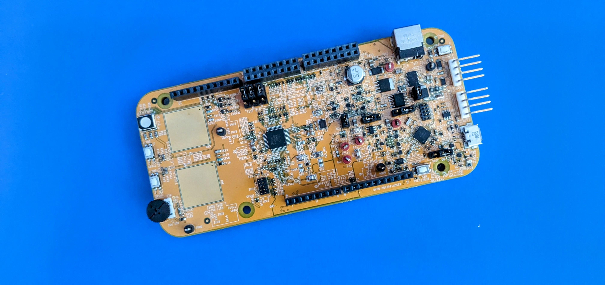

  

<h2 align="center">
    S32K118EV - Drivers / Projects / Templates
</h2>

#### Description

***
The repository is intented to store multiple libraries for some modules(temperature sensors, accelerometer and gyroscope, DAC device, etc), also included templates projects for FreeRTOS, and CMSIS-DSP.

The projects are created using [S32 Design Studio IDE](https://www.nxp.com/design/design-center/software/automotive-software-and-tools/s32-design-studio-ide:S32-DESIGN-STUDIO-IDE):

***
#### Drivers

- [tm1637]() : TM1637 is a kind of LED (light-emitting diode display) drive control special circuit with keyboard scan interface and it's internally integrated with MCU digital interface

***
#### Templates

- FreeRTOS
- CMSIS-DSP

***
#### Projects

